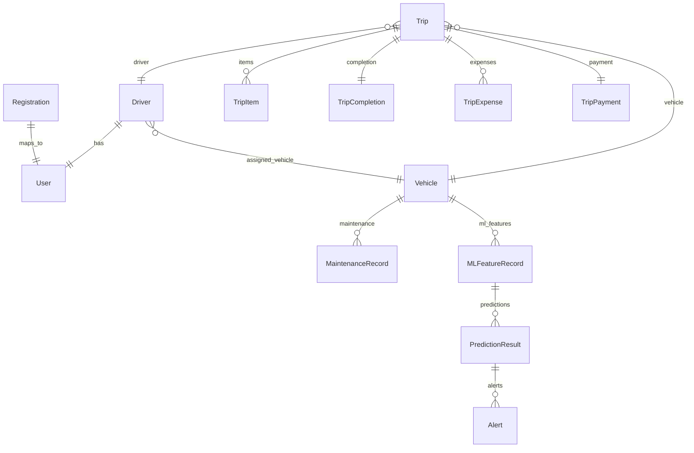
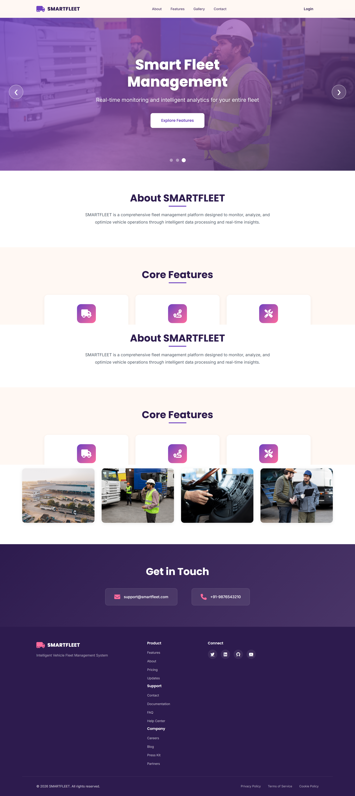
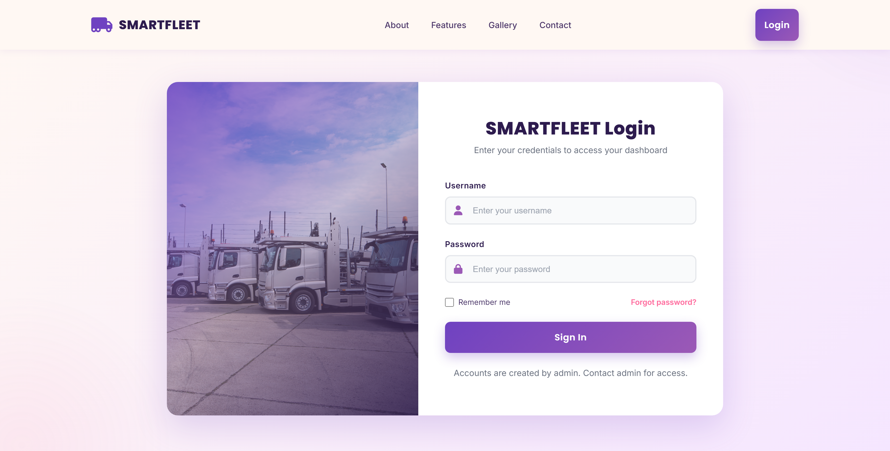
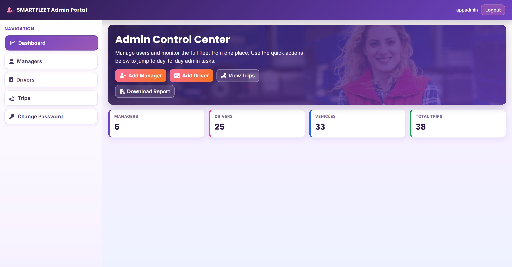
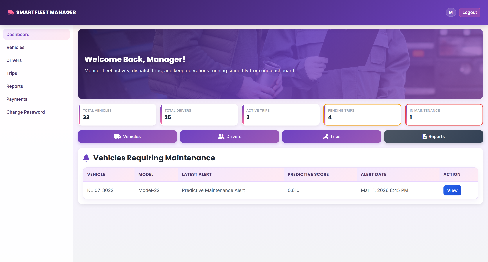

# SMARTFLEET – Fleet Management System

SMARTFLEET is a role‑based fleet management web application built with Django. It supports Admin, Manager, and Driver workflows for vehicle assignment, trip operations, reports, and predictive maintenance alerts. The system includes structured trip item tracking and a demo payment workflow.

---

## Features

### Admin
- Create and manage managers and drivers
- Block/unblock users
- View driver profile details

### Manager
- Add, edit, delete vehicles and view maintenance/trip history
- Assign/unassign vehicles to drivers
- Create trips with delivery item details
- View all trips with filters and detailed trip view
- Generate completed trip reports (CSV + print)
- View predictive maintenance alerts (vehicle‑specific)
- Dummy payment flow for trip payouts (demo only)

### Driver
- View assigned vehicle, active trips, completed trips
- Accept or reject trips
- Complete trips with telemetry inputs (engine temp, oil quality, brake condition, etc.)
- View trip details and trip item list
- Reports page with print/CSV export
- Driver profile completion required before assignment

---

## Map‑Based Routing 

For manager trip creation:
- Origin and Destination use a search‑select dropdown (OpenStreetMap Nominatim)
- Estimated distance and time auto‑fill (OSRM routing)

Driver trip detail:
- Route map shown using Leaflet + OSRM, based on planned origin/destination

No paid API keys required.

---

## Predictive Maintenance (ML Integration)

- After trip completion, telemetry data is used to run a predictive maintenance model
- If maintenance is required:
  - Vehicle status updates to “Maintenance Required”
  - Alert is generated for managers
- ML features stored in `MLFeatureRecord`, predictions in `PredictionResult`

---

## Tech Stack

- Backend: Django (Python)
- Frontend: HTML, CSS, JS
- Database: SQLite (development)
- Maps/Search: OpenStreetMap Nominatim + OSRM + Leaflet
- ML: Scikit‑learn (predictive maintenance model)

---

## Project Structure (Main)

```
s_fleet/
├─ models.py
├─ views.py
├─ urls.py
├─ ml/
│  ├─ predictive_maintenance.py
│  └─ train_artifacts.py
templates/
static/
```

---

## API Routes Summary

### Auth
- `/login/` – Login
- `/logout/` – Logout
- `/password/change/` – Change password

### Admin
- `/admin/home/`
- `/admin/managers/` (list, add, edit, toggle, delete)
- `/admin/drivers/` (list, add, edit, toggle, delete, view profile)
- `/admin/trips/` (list + filters)
- `/admin/trips/<id>/` (trip detail)
- `/admin/trips/report/` (CSV)

### Manager
- `/manager/home/`
- `/manager/vehicles/` (list, create, edit, delete, detail)
- `/manager/drivers/` (list, detail, assign, unassign)
- `/manager/trips/` (list + filters)
- `/manager/trips/create/`
- `/manager/trips/<id>/` (trip detail)
- `/manager/reports/completed-trips/` (CSV/print)
- `/manager/payments/` (dummy payment flow)

### Driver
- `/driver/home/`
- `/driver/trips/` (list)
- `/driver/trips/<id>/` (detail + accept/reject/complete)
- `/driver/trips/<id>/complete/`
- `/driver/reports/completed-trips/` (CSV/print)
- `/driver/payments/`
- `/driver/profile/`

---

## Database Schema (High‑Level)



---

## Screenshots







---

## Run Locally

```
python manage.py migrate
python manage.py runserver
```

---

## Future Improvements

Possible enhancements for SMARTFLEET:

- Real-time vehicle GPS tracking
- Mobile app for drivers
- Automated fuel anomaly detection
- Integration with payment gateways
- Self-hosted routing services instead of public APIs
- Advanced ML models for driver risk prediction
